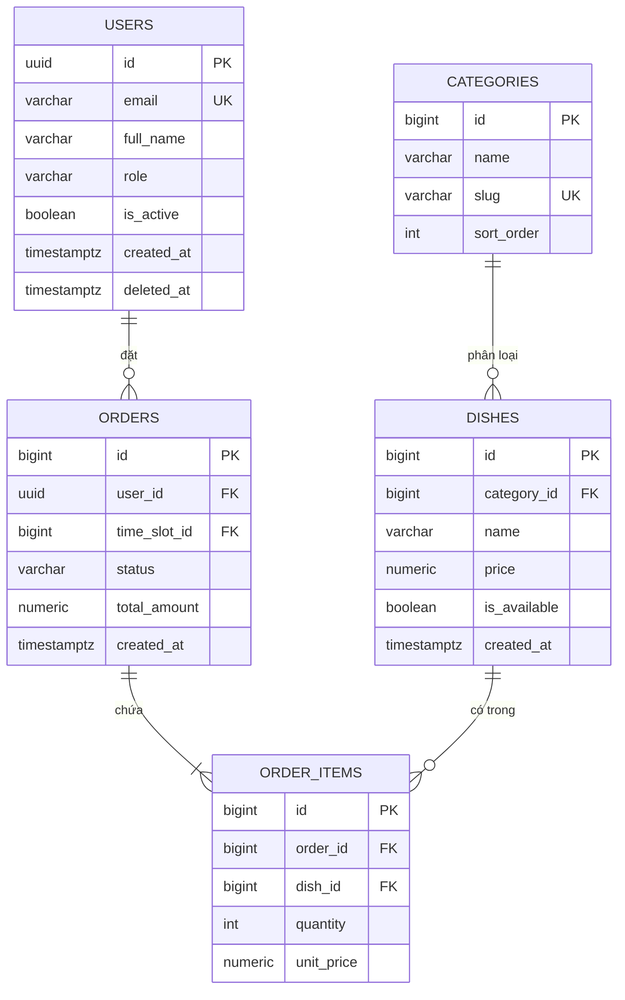

# DB Design — Cấu trúc SQL migration & Mermaid ERD đầy đủ

> File tham chiếu của skill /db-design — SKILL.md trỏ tới đây (progressive disclosure). ĐỌC TOÀN BỘ file này khi thực thi skill.

## Output 2: SQL Migration Script

Tạo file `.sql` theo chuẩn PostgreSQL, chia thành 3 phần:

```sql
-- ═══════════════════════════════════════════════════════════
-- [TÊN DỰ ÁN] — Database Migration
-- Generated by: DB Design Skill
-- Database: PostgreSQL 14+
-- Date: [date]
-- ═══════════════════════════════════════════════════════════

-- ── EXTENSIONS ─────────────────────────────────────────────
CREATE EXTENSION IF NOT EXISTS "pgcrypto";  -- for gen_random_uuid()

-- ══════════════════════════════════════════════════════════
-- PART 1: LOOKUP / ENUM TABLES (no foreign keys)
-- ══════════════════════════════════════════════════════════

CREATE TABLE categories (
    id          BIGSERIAL PRIMARY KEY,
    name        VARCHAR(100) NOT NULL,
    slug        VARCHAR(100) NOT NULL UNIQUE,
    sort_order  INTEGER NOT NULL DEFAULT 0,
    is_active   BOOLEAN NOT NULL DEFAULT true,
    created_at  TIMESTAMPTZ NOT NULL DEFAULT NOW(),
    updated_at  TIMESTAMPTZ NOT NULL DEFAULT NOW()
);

-- ══════════════════════════════════════════════════════════
-- PART 2: CORE TABLES (with foreign keys, ordered by dependency)
-- ══════════════════════════════════════════════════════════

CREATE TABLE users (
    id           UUID PRIMARY KEY DEFAULT gen_random_uuid(),
    email        VARCHAR(255) NOT NULL UNIQUE,
    full_name    VARCHAR(255) NOT NULL,
    role         VARCHAR(50)  NOT NULL DEFAULT 'employee'
                 CHECK (role IN ('employee', 'canteen_staff', 'admin')),
    is_active    BOOLEAN      NOT NULL DEFAULT true,
    created_at   TIMESTAMPTZ  NOT NULL DEFAULT NOW(),
    updated_at   TIMESTAMPTZ  NOT NULL DEFAULT NOW(),
    deleted_at   TIMESTAMPTZ  NULL     -- soft delete
);

-- ...thêm bảng theo thứ tự dependency...

-- ══════════════════════════════════════════════════════════
-- PART 3: INDEXES
-- ══════════════════════════════════════════════════════════

-- users
CREATE INDEX idx_users_email      ON users(email);
CREATE INDEX idx_users_role       ON users(role) WHERE deleted_at IS NULL;

-- orders
CREATE INDEX idx_orders_user_id   ON orders(user_id);
CREATE INDEX idx_orders_status    ON orders(status);
CREATE INDEX idx_orders_created   ON orders(created_at DESC);

-- ══════════════════════════════════════════════════════════
-- PART 4: SEED DATA (lookup tables)
-- ══════════════════════════════════════════════════════════

INSERT INTO categories (name, slug, sort_order) VALUES
  ('Cơm', 'com', 1),
  ('Món nước', 'mon-nuoc', 2),
  ('Đồ uống', 'do-uong', 3);
```

---


## Output 3: Mermaid ERD (`[TênDựÁn]_ERD.md`)

File Markdown chứa Mermaid diagram — paste vào GitHub/GitLab README, Notion, hoặc bất kỳ tool nào hỗ trợ Mermaid để render thành sơ đồ quan hệ trực quan:

```markdown
# [Tên dự án] — Entity Relationship Diagram



**Cách dùng:**
- GitHub/GitLab: paste vào README.md → tự render
- VS Code: cài extension "Markdown Preview Mermaid Support"
- Mermaid Live Editor: mermaid.live → paste để export PNG/SVG
- Notion: paste code block, chọn Mermaid

## Chế độ chạy lại (re-run) — BẮT BUỘC kiểm tra trước khi sinh file

Nếu `[TênDựÁn]_DB_Design.xlsx` đã tồn tại trong workspace:
1. Load file cũ, chỉ thêm/sửa bảng thay đổi — giữ nguyên phần không đổi.
2. Migration mới ghi thành file DELTA `[TênDựÁn]_migration_[N]_<mô-tả>.sql` — **KHÔNG ghi đè `migration.sql` cũ** (có thể đã chạy trên DB thật; ghi đè = mất khả năng trace).
3. Chạy lại Health Check trên TOÀN schema (cũ + mới), cập nhật ERD.md.
4. KHÔNG regenerate từ đầu trừ khi người dùng yêu cầu rõ "làm lại từ đầu".

